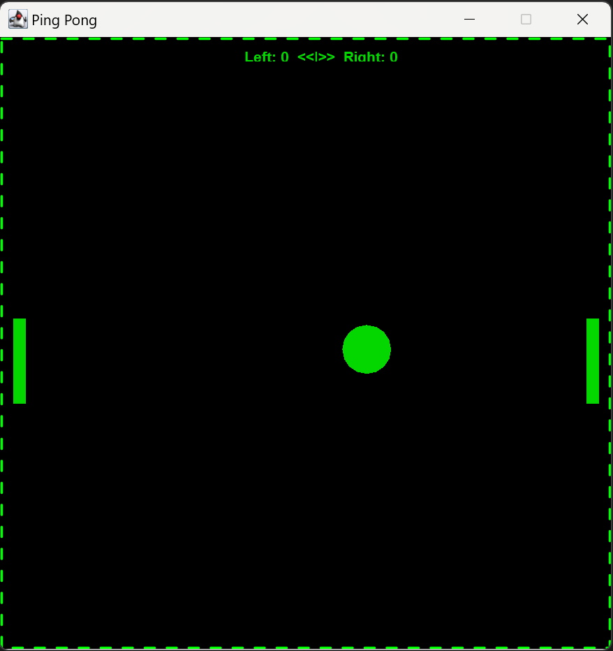

##### JAVA Ping Pong game

Simple java Ping Pong for two people

Run the .exe file, input a number of points you want to and play

The ball first starts slow and gets faster with each touch and is then reseted to the starting speed after a point is scored.

The points are displayed at the top.

###### Keys:

- To move the left paddle use: (w/s)

- To move the right paddle use: (up-arrow/down-arrow)

